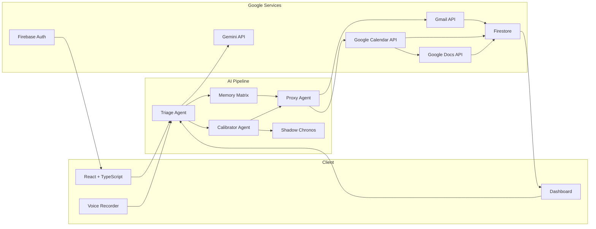
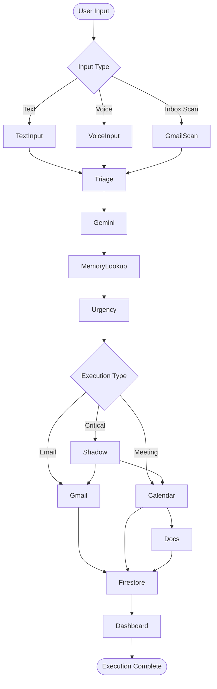
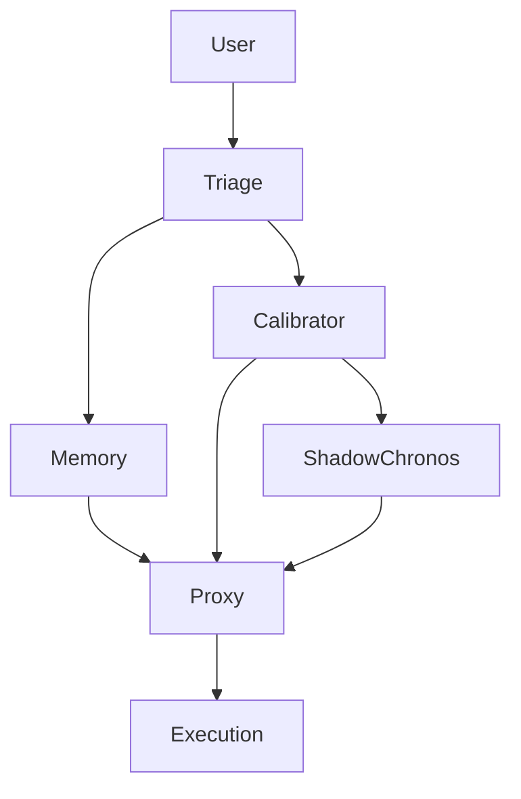
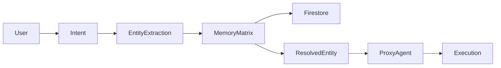
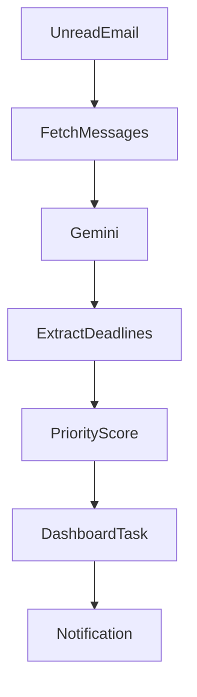
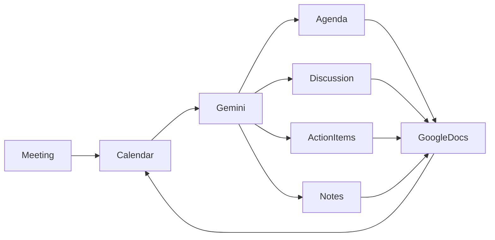
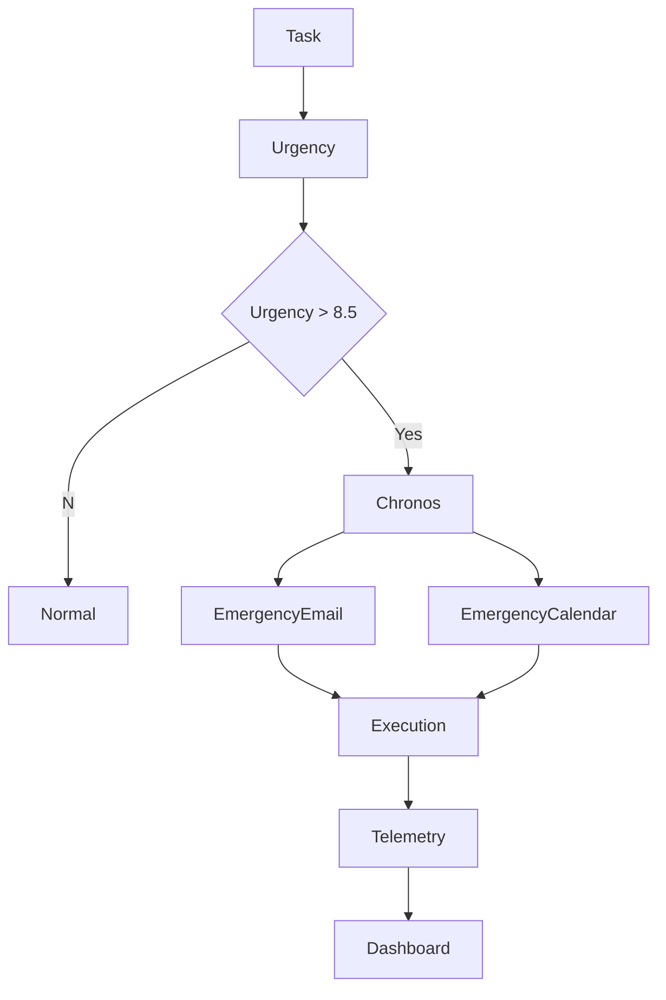
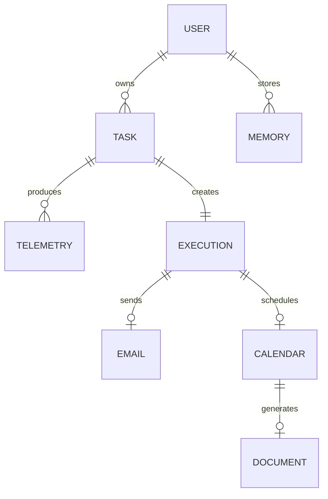
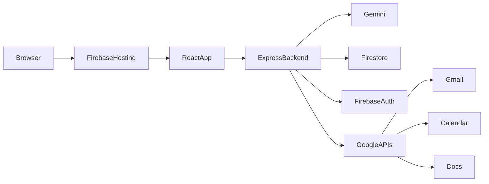

<div align="center">


### Autonomous Multi-Agent Productivity System powered by Google Gemini

Transforming **intent into execution** through autonomous AI agents, persistent memory, contextual reasoning, and Google Workspace integration.

<p>


</p>

[Live Demo](https://agentzero-18082.web.app/)

</div>

---

# Overview

Agent Zero is an **autonomous execution system** designed to solve one of the biggest flaws in modern productivity software:

> Traditional productivity tools remind users what to do.
>
> **Agent Zero helps users actually get it done.**

Instead of functioning as another passive task manager, Agent Zero continuously reasons about user intent, remembers important context, determines urgency, and executes actions directly through Google Workspace.

The platform combines multiple AI agents with persistent memory, contextual reasoning, Gmail, Calendar, Google Docs, Firestore, and Google Gemini to create an execution-first productivity experience.

---

# The Problem

Professionals and students rarely fail because they forget tasks.

They fail because of:

- cognitive overload
- context switching
- procrastination
- fragmented information
- passive reminders that are easy to ignore

Today's productivity apps notify.

Tomorrow's productivity apps execute.

Agent Zero was built around that philosophy.

---

# The Solution

Instead of asking users to manually organize every task, Agent Zero continuously transforms raw, unstructured thoughts into executable workflows.

Examples include:

**Input**

> "Email Rahul the project report tomorrow."

↓

Agent Zero

- understands intent
- finds Rahul inside Memory Matrix
- retrieves Rahul's email
- drafts the email
- schedules delivery
- creates calendar reminder if needed

---

**Input**

> "Schedule a meeting with the frontend team next Tuesday."

↓

Agent Zero

- extracts date & time
- generates calendar event
- creates meeting agenda
- generates preparation document
- attaches Google Docs link
- inserts event into Google Calendar

---

**Input**

> "The production server is failing... I'll fix it next week."

↓

Agent Zero

- detects dangerous procrastination
- activates Shadow Chronos
- calculates risk
- prepares emergency response
- drafts stakeholder email
- blocks emergency mitigation session
- executes both after confirmation

---

# Why Agent Zero?

Modern AI assistants are excellent at answering questions.

Very few actually **complete work.**

Agent Zero focuses on the final mile:

```
Reminder Apps

Task
   │
Notification
   │
User ignores notification
   │
Task remains incomplete
```

vs

```
Agent Zero

Intent
   │
AI Reasoning
   │
Memory Lookup
   │
Urgency Analysis
   │
Execution Plan
   │
Google Workspace Actions
   │
Task Completed
```

---

# Key Features

## Autonomous Multi-Agent System

Instead of relying on a single prompt, Agent Zero divides responsibilities among specialized agents.

| Agent | Responsibility |
|---------|----------------|
| 🧠 Triage Agent | Understands messy human language |
| ⚡ Calibrator Agent | Computes urgency and business impact |
| 🗂 Memory Matrix | Stores long-term contextual knowledge |
| 🚀 Proxy Agent | Executes Gmail & Calendar actions |
| 🚨 Shadow Chronos | Handles critical procrastination scenarios |

---

## Persistent Memory Matrix

Unlike stateless chatbots, Agent Zero remembers important entities across conversations.

Example:

```
Rahul
↓

rahul123@gmail.com
```

Later:

```
Email Rahul the report.
```

↓

```
TO:
rahul123@gmail.com
```

No need for the user to repeat information.

---

## Voice-first Task Capture

Users can speak naturally.

Example:

> "Pay Amit tomorrow, cancel Netflix this week and remind me about my interview."

Agent Zero converts one voice recording into multiple structured tasks automatically.

---

## Inbox Fire Scanner

Instead of waiting for users to create tasks, Agent Zero actively discovers deadlines hidden inside unread emails.

Examples:

- Assignment deadlines
- Client meetings
- Interview invitations
- Bill reminders
- Schedule changes

The extracted tasks immediately appear inside the dashboard.

---

## Google Workspace Execution

Agent Zero performs real work instead of generating suggestions.

Supported integrations:

- Gmail
- Google Calendar
- Google Docs
- Firebase Authentication
- Firestore

---

## AI Preparation Bundles

Scheduling a meeting isn't enough.

When a meeting is created, Agent Zero automatically generates a preparation package.

The generated Google Doc may include:

- Meeting Agenda
- Objectives
- Discussion Points
- Background Context
- Talking Points
- Action Items
- Follow-up Checklist
- Meeting Notes Template

The generated document is linked directly inside the Google Calendar event.

---

## Shadow Chronos

Shadow Chronos is Agent Zero's emergency intervention system.

When high-risk procrastination is detected, the platform changes from passive assistance to active mitigation.

Instead of waiting, it prepares:

- emergency stakeholder communication
- mitigation calendar blocks
- execution workflow
- telemetry logging
- dual Google Workspace deployment

---
<!-- 
# Product Screenshots

> Replace these placeholders with actual screenshots before submission.

| Dashboard | Memory Matrix |
|------------|---------------|
|  |  |

| Shadow Chronos | Calendar Execution |
|----------------|--------------------|
|  |  |

| Inbox Scanner | Preparation Bundle |
|---------------|--------------------|
|  |  |

--- -->

# Demonstration

The recommended demo flow:

1. Voice Input
2. Gmail Execution
3. Calendar Scheduling
4. Preparation Bundle Generation
5. Inbox Fire Scanner
6. Memory Matrix Recall
7. Shadow Chronos Emergency Flow

This demonstrates the complete autonomous execution lifecycle.

---

# What Makes Agent Zero Different?

| Traditional Productivity Apps | Agent Zero |
|-------------------------------|------------|
| Static reminders | Autonomous reasoning |
| Manual task creation | AI-generated workflows |
| Stateless | Persistent Memory Matrix |
| Passive notifications | Google Workspace execution |
| No context | Context-aware decision making |
| User performs work | AI prepares work |
| Stores tasks | Executes tasks |

---

# System Architecture

Agent Zero follows an **event-driven, multi-agent architecture** where every user interaction is transformed into structured execution pipelines. Rather than relying on a monolithic AI prompt, the system distributes responsibilities across specialized agents that collaborate to complete tasks.



---

# End-to-End Execution Pipeline

Every interaction inside Agent Zero follows the same execution lifecycle.



---

# Multi-Agent Workflow

Rather than asking one LLM to solve everything, Agent Zero distributes work between multiple autonomous agents.



---

# AI Agent Responsibilities

## Triage Agent

Responsible for understanding human language.

Inputs:

- Natural language
- Voice recordings
- Gmail inbox snippets

Outputs:

- Structured JSON
- Task title
- Intent classification
- Recipient extraction
- Deadlines
- Entities

---

## Calibrator Agent

Computes execution priority.

Responsible for:

- Urgency Index
- Business impact
- Deadline reasoning
- Consequence estimation
- Threat classification

Outputs:

```
Urgency: 9.4/10

Intent:
EMAIL

Deadline:
Tomorrow 5 PM

Risk:
Critical
```

---

## Memory Matrix

Maintains long-term context.

Instead of repeatedly asking the user for information, Agent Zero continuously stores important entities.

Examples:

| Entity | Value |
|---------|------|
| Rahul | rahul123@gmail.com |
| Manager | alex@company.com |
| Internship | Google STEP |
| Project | Agent Zero |

When the user later writes

```
Email Rahul
```

the Memory Matrix automatically resolves

```
TO:
rahul123@gmail.com
```

without asking again.

---

# Memory Resolution Pipeline



---

# Inbox Fire Scanner

One of Agent Zero's proactive capabilities.

Instead of waiting for users to create tasks, the system periodically scans unread Gmail messages looking for deadlines.

Workflow:



Examples detected automatically:

- Assignment deadlines

- Interview invitations

- Utility bills

- Client meetings

- Schedule updates

---

# Preparation Bundle Pipeline

Unlike traditional scheduling tools, Agent Zero prepares users for meetings.



Each generated document may include:

- Meeting agenda

- Context

- Objectives

- Stakeholders

- Discussion points

- AI-generated preparation notes

- Follow-up checklist

---

# Shadow Chronos

Shadow Chronos activates whenever severe procrastination or high-risk delay is detected.

Instead of waiting for the user to act, it prepares mitigation workflows.



---

# Firestore Data Model



---

# Deployment Architecture



---

# Google Ecosystem Integration

Agent Zero integrates deeply with Google's ecosystem.

| Service | Purpose |
|----------|---------|
| Gemini | Natural language reasoning and planning |
| Firebase Authentication | Secure OAuth login |
| Firestore | Persistent storage |
| Gmail API | Drafting and sending emails |
| Calendar API | Scheduling events |
| Google Docs API | AI-generated preparation bundles |
| Cloud Hosting | Production deployment |

---

# Why Multi-Agent?

Most AI productivity tools use one prompt.

Agent Zero distributes responsibility across specialized agents.

Benefits include:

- Better reasoning

- Easier debugging

- Modular architecture

- Higher extensibility

- Better prompt isolation

- Independent execution

This architecture also allows future integrations such as Slack, Microsoft Teams, Notion, Jira, and GitHub without redesigning the entire system.

---

---

# Project Structure

The project is organized around a modular, agent-based architecture.

```text
agent-zero/
│
├── public/
│
├── server/
│   ├── controllers/
│   ├── middleware/
│   ├── routes/
│   ├── services/
│   ├── utils/
│   └── index.ts
│
├── src/
│   │
│   ├── agents/
│   │   ├── triage/
│   │   ├── calibrator/
│   │   ├── proxy/
│   │   ├── memory/
│   │   ├── inbox-scanner/
│   │   └── shadow-chronos/
│   │
│   ├── components/
│   │
│   ├── pages/
│   │
│   ├── hooks/
│   │
│   ├── services/
│   │   ├── gemini.ts
│   │   ├── gmail.ts
│   │   ├── calendar.ts
│   │   ├── docs.ts
│   │   └── firestore.ts
│   │
│   ├── firebase.ts
│   ├── App.tsx
│   └── main.tsx
│
├── firestore.rules
├── package.json
├── tsconfig.json
├── vite.config.ts
├── README.md
└── .env.example
```

---

# Local Development

Clone the repository

```bash
git clone https://github.com/sadSanta-07/Agent-Zero

cd agent-zero
```

Install dependencies

```bash
npm install
```

Run development server

```bash
npm run dev
```

Create production build

```bash
npm run build
```

---

# Environment Variables

Create a `.env` file in the project root.

```env
# Gemini

GEMINI_API_KEY=

# Firebase

VITE_FIREBASE_API_KEY=

VITE_FIREBASE_AUTH_DOMAIN=

VITE_FIREBASE_PROJECT_ID=

VITE_FIREBASE_STORAGE_BUCKET=

VITE_FIREBASE_MESSAGING_SENDER_ID=

VITE_FIREBASE_APP_ID=

# Google OAuth

GOOGLE_CLIENT_ID=

GOOGLE_CLIENT_SECRET=
```

---

# REST API Overview

The backend exposes lightweight REST endpoints used by the dashboard.

| Endpoint | Description |
|-----------|-------------|
| `/api/triage` | Converts raw input into structured task data |
| `/api/proxy/email` | Executes Gmail workflow |
| `/api/proxy/calendar` | Creates Google Calendar events |
| `/api/proxy/docs` | Generates preparation bundles |
| `/api/memory` | Stores and retrieves contextual entities |
| `/api/fire-scan` | Scans unread Gmail for deadlines |
| `/api/shadow-chronos` | Executes critical mitigation workflow |

---

# Firestore Collections

```text
users/
    └── userId

tasks/
    └── taskId

memory/
    └── entityId

telemetry/
    └── logId

executions/
    └── executionId
```

---

# Security

Agent Zero follows a confirmation-first execution model.

- Google OAuth authentication
- Firebase Authentication
- Secure Firestore rules
- OAuth access tokens are never committed
- Sensitive credentials are stored using environment variables
- High-impact actions require explicit user confirmation

---

# Performance Optimizations

The application is optimized for responsiveness.

- Lazy component loading
- Optimized React rendering
- Firestore persistence
- Session caching
- Incremental task updates
- Minimal network payloads
- Context-aware Gemini prompts

---

# Error Handling

Agent Zero gracefully handles failures.

Examples include:

- Gmail API failures
- Calendar API failures
- Missing permissions
- Firestore offline mode
- Gemini rate limits
- OAuth expiration

Fallback behavior ensures the interface remains responsive even if external services fail.

---

# Current Capabilities

| Capability | Status |
|------------|--------|
| Text Understanding | ✅ |
| Voice Processing | ✅ |
| Gmail Execution | ✅ |
| Calendar Scheduling | ✅ |
| Preparation Bundle Generation | ✅ |
| Memory Matrix | ✅ |
| Inbox Fire Scanner | ✅ |
| Shadow Chronos | ✅ |
| Firebase Authentication | ✅ |
| Firestore Persistence | ✅ |

---

# Future Roadmap

Upcoming improvements include:

### Productivity

- Slack Integration
- Microsoft Teams
- Notion
- GitHub Issues
- Jira
- Discord

### Intelligence

- Long-term RAG memory
- Personal knowledge graph
- Context compression
- Agent collaboration
- Autonomous planning

### Platform

- Chrome Extension
- Android application
- iOS application
- Desktop application
- Offline execution

---

# Contributing

Contributions are welcome.

1. Fork the repository

2. Create a feature branch

```bash
git checkout -b feature/new-feature
```

3. Commit your changes

```bash
git commit -m "Add new feature"
```

4. Push

```bash
git push origin feature/new-feature
```

5. Open a Pull Request

---

# Demo Checklist

Recommended demo order:

- Login using Google
- Voice task capture
- Memory Matrix recall
- Gmail execution
- Calendar scheduling
- Preparation Bundle generation
- Inbox Fire Scanner
- Shadow Chronos emergency workflow
- Telemetry logs

---

# Acknowledgements

Built using:

- Google Gemini
- Firebase
- React
- TypeScript
- Tailwind CSS
- Express
- Google Workspace APIs

Special thanks to the Google developer ecosystem for enabling rapid experimentation with AI-powered productivity systems.

---

# License

This project is licensed under the MIT License.

---

<div align="center">

## Agent Zero

**Think Less. Execute More.**

**MADE BY SAHIL SINGH.**

*"The best productivity system isn't the one that reminds you what to do.*

*It's the one that helps you finish it."*

</div>